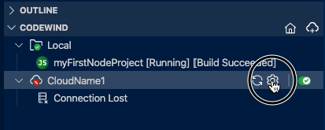

# Removing your remote deployment of Codewind

The Codewind CLI `cwctl` is designed to do almost all the steps required to remove a remote deployment of Codewind by chaining together a number of Kubernetes operations.

There are two modes of use. You can:

1. Remove Codewind
2. Remove Keycloak

## Removing a remote deployment of Codewind

You will find `cwctl` in your HOME directory under the path ~/.codewind/{version}

1.  Open a new terminal window on your local workstation
2.  Navigate to your home directory and to the Codewind cli:

```
cd ~/.codewind/0.8.0
```

The command to remove just the Codewind deployment is:

`cwctl remove remote --namespace <namespace> --workspace <workspaceID>`

Where parameters `<namespace>` and `<workspaceID>` are used to identify which Kubernetes resources to remove. If you are unsure of the `<workspaceID>`, you can find it as part of the ingress or route URL used when you created the connection in your IDE:

eg:

```
https://codewind-gatekeeper-k412oms7.apps.mycluster.X.X.X.X.nip.io
                            ^^^^^^^^
```

enter the command and review the results :

```
cwctl remove remote --namespace mycodewind-ns --workspace k55333j0

INFO[0000] Running on openshift: true
INFO[0000] Checking namespace mycodewind-ns exists
INFO[0000] Found 'mycodewind-ns' namespace
INFO[0001] Removal summary:
INFO[0001] Codewind PFE Deployment: Removed
INFO[0001] Codewind PFE Service: Removed
INFO[0001] Codewind PFE PVC: Removed
INFO[0001] Codewind Performance Deployment: Removed
INFO[0001] Codewind Performance Service: Removed
INFO[0001] Codewind Gatekeeper Deployment: Removed
INFO[0001] Codewind Gatekeeper Service: Removed
INFO[0001] Codewind Gatekeeper Ingress: Removed
INFO[0001] Codewind Role Bindings: Removed
INFO[0001] Codewind Service Account: Removed
INFO[0001] Kubernetes namespace: CWCTL will not remove the namespace automatically, 
use 'kubectl delete namespace mycodewind-ns' if you would like to remove it
```

>Since it is possible to install multiple Codewind servers into a Kubernetes namespace the cwctl will not remove the namespace as part of the uninstall. You should only remove the namespace if you no longer need it and are sure there are no other applications installed inside it. For now we will leave the namespace in place.


## Removing Keycloak service

Keycloak can be installed alongside a single Codewind deployment or shared by many other Codewind services.

WARNING: Removing Keycloak breaks all remote deployments of Codewind that are using it for authentication. Users will no longer be able to login and will require a full redeploy to recover.

If you are ready to remove Keycloak, use the following `cwctl` command:

enter the command and review the results:

```
cwctl remove keycloak --namespace mycodewind-ns --workspace k55333j0

INFO[0000] Running on Openshift: true
INFO[0000] Checking namespace mycodewind-ns exist
INFO[0000] Found 'mycodewind-ns' namespace
INFO[0000] Removal summary:
INFO[0000] Keycloak Deployment: Removed
INFO[0000] Keycloak Service: Removed
INFO[0000] Keycloak PVC: Removed
INFO[0000] Keycloak Ingress: Removed
INFO[0000] Keycloak Secrets: Removed
INFO[0000] Keycloak Service Account: Removed
INFO[0000] Kubernetes namespace: CWCTL will not remove the namespace automatically, 
use 'kubectl delete namespace mycodewind-ns' if you would like to remove it
```

>You should only remove the namespace if you no longer need it and are sure there are no other applications installed inside it.

Any previously configured IDEs will now be in a "disconnected" state. In this screenshot the remote deployment called MyIBMCloud is offline. Click the connection properties icon beside it:



and then click the 'Remove Connection" button.

You have now removed the Codewind and Keycloak services from your cloud platform, you also removed the linkage to it from your IDE.
